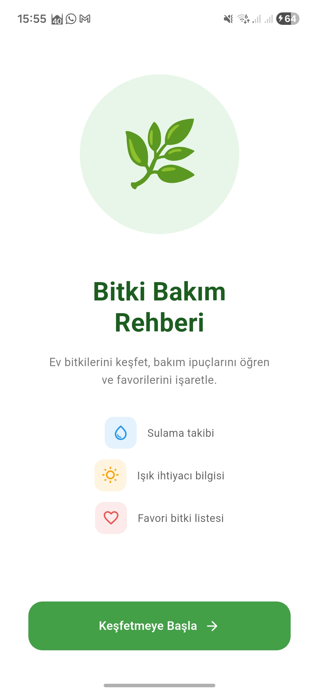
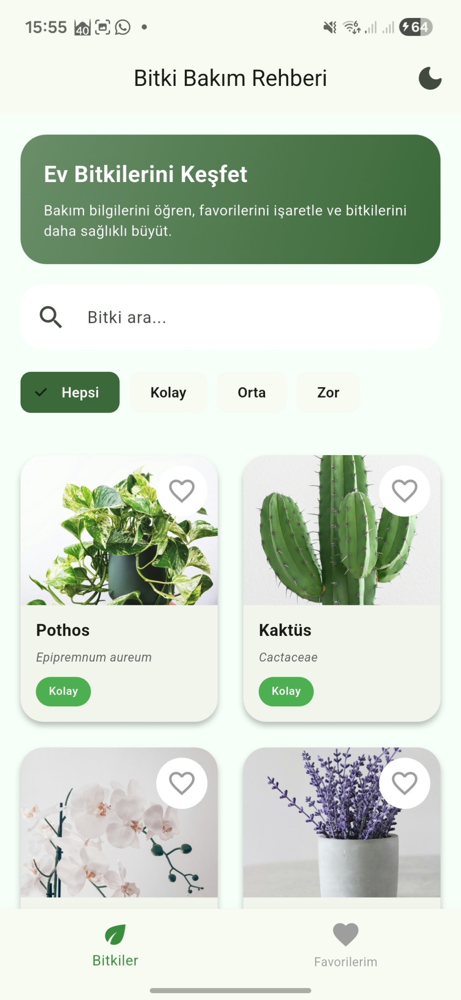
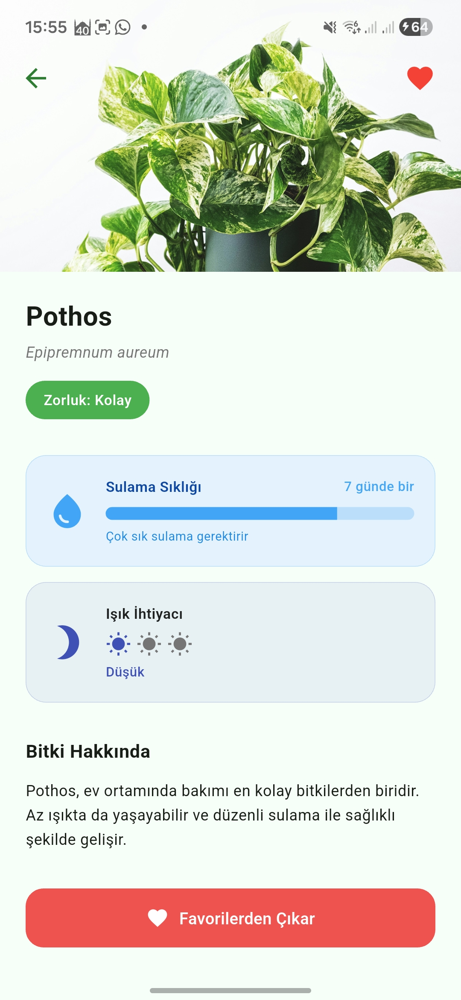
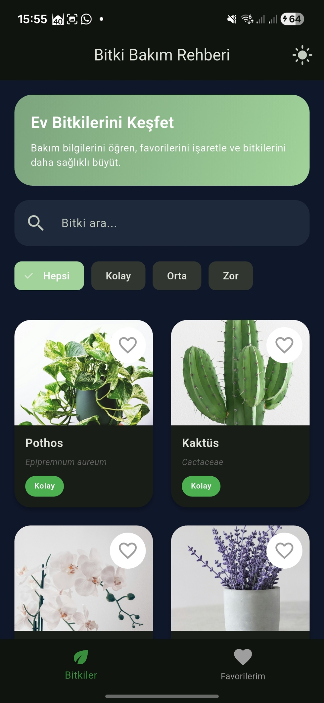
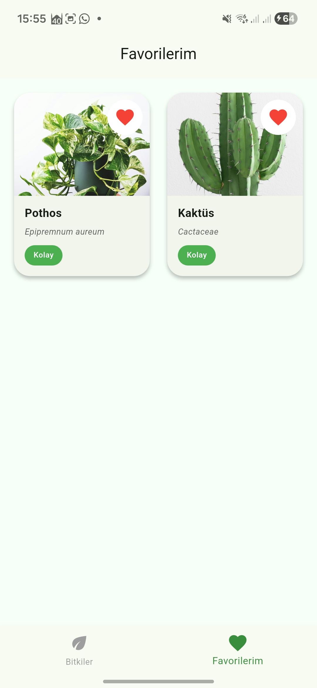

# 🌿 Bitki Bakım Rehberi

Ev bitkilerini keşfet, bakım bilgilerini öğren ve favorilerini işaretle.  
Flutter ile geliştirilmiş kart tabanlı mobil katalog uygulaması.

---

## Özellikler

- 6 farklı ev bitkisi — GridView kart tasarımı
- Zorluk seviyesine göre filtreleme (Kolay / Orta / Zor)
- Bitki arama
- Favori ekleme / çıkarma (state yönetimi)
- Detay sayfası — sulama sıklığı, ışık ihtiyacı, açıklama
- Hero animasyonu ile sayfa geçişi
- Material 3 yeşil tema

---

## Kullanılan Flutter Sürümü
Flutter 3.38.0
Dart 3.10.0

---

## Kurulum ve Çalıştırma

```bash
# Repoyu klonla
git clone https://github.com/emine370/plant-care-guide.git

# Proje klasörüne gir
cd bitki_bakim_rehberi

# Bağımlılıkları yükle
flutter pub get

# Uygulamayı çalıştır
flutter run
```

---

## Ekran Görüntüleri

| Ana Sayfa | Bitki Listesi | Detay | Koyu Tema | Favoriler |
|-----------|--------------|-------|-----------|-----------|
|  |  |  |  |  |

---

## Proje Yapısı

```text
lib/
├── main.dart
├── models/
│   └── plant.dart
├── data/
│   └── plants_data.dart
├── screens/
│   ├── plant_list_screen.dart
│   ├── plant_detail_screen.dart
│   ├── favorites_screeen.dart
│   └── welcome_screen.dart
├── theme/
│   ├── app_theme.dart
│   ├── theme_provider.dart
└── widgets/
    └── plant_card.dart
```

---

## Geliştirici

**Emine Hatun ALTINPINAR**
Flutter Günlük Eğitim Projesi
